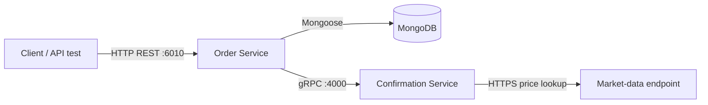

# Distributed Order Confirmation System

A small distributed-systems project for creating and managing stock orders. The public **Order Service** exposes an HTTP/REST API, persists orders in MongoDB, and calls the **Confirmation Service** using gRPC when an order is confirmed. The confirmation service retrieves the current price for the order's ISIN from an external market-data endpoint.

## Table of contents

- [Concept](#concept)
- [Features](#features)
- [Architecture](#architecture)
- [Layers](#layers)
- [Data model](#data-model)
- [Tech stack](#tech-stack)
- [Project structure](#project-structure)
- [Getting started](#getting-started)

## Concept

The project separates the order-management concern from the price-confirmation concern:

- Clients use HTTP to create, inspect, update, and delete orders.
- The Order Service owns the order lifecycle and stores orders in MongoDB.
- When the client confirms an order, the Order Service makes a gRPC call to the Confirmation Service.
- The Confirmation Service resolves a price for the supplied ISIN and returns the result to the Order Service.
- The Order Service saves the confirmed price and advances the order state.

This demonstrates synchronous service-to-service communication using both REST and gRPC, plus containerized deployment with Docker and Kubernetes.

## Features

- Create, list, retrieve, update, and delete stock orders through a REST API.
- Filter orders by state with `GET /orders?state=<state>`.
- Confirm an order through a gRPC call to the Confirmation Service.
- Confirm only when the resolved price is below a maximum value using `maxPrice`.
- Persist orders in MongoDB using Mongoose.
- Run the services as Docker containers or as Kubernetes workloads.
- Use a MongoDB StatefulSet with persistent storage in Kubernetes.
- Run a basic load endpoint at `GET /overload`; the `api-tests` folder contains a k6 script for it.

## Architecture



In Kubernetes, only the Order Service is exposed externally through a NodePort service. MongoDB and the Confirmation Service use internal cluster Services. The Order Service reaches the confirmation service through the Kubernetes DNS name `confirmation-service-service:4000`.

## Layers

| Layer | Responsibility | Main implementation |
| --- | --- | --- |
| API layer | Handles HTTP requests and responses for orders. | `order-service/index.js` |
| Application layer | Applies order lifecycle rules and coordinates confirmation. | `order-service/index.js` |
| gRPC client layer | Calls the Confirmation Service from the Order Service. | `order-service/client.js` |
| gRPC service layer | Implements price confirmation RPCs. | `confirmation-service/server.js` |
| Persistence layer | Connects to MongoDB and maps documents to orders. | `order-service/db/` |
| Infrastructure layer | Defines containers, Kubernetes Services, Deployments, and StatefulSet. | `Dockerfile`, `manifests/` |

## Data model

An order is stored in MongoDB with the following fields:

| Field | Type | Description |
| --- | --- | --- |
| `_id` | MongoDB ObjectId | Unique order identifier. |
| `name` | string | Customer or order name. |
| `isin` | string | Financial instrument identifier. |
| `amount` | integer | Requested quantity. |
| `price` | number | Confirmed price; initially `0`. |
| `state` | integer | Order lifecycle state; initially `0`. |

The implemented workflow is:

`0` (new) → `1` (confirmed) → `2` → `3`

An amount may only be changed while state is `0`. Confirmation changes state `0` to `1`. State updates use `PATCH /orders/:id/state` and require the next state in sequence.

## Tech stack

- **Node.js 22** and **Express** for the HTTP Order Service.
- **gRPC for Node.js** and Protocol Buffers for internal service calls.
- **MongoDB** and **Mongoose** for persistence.
- **Axios** for the external price request.
- **Docker** and Docker Hub for container images.
- **Kubernetes / Minikube** for local orchestration.
- **k6** for the included load-test script.

## Project structure

```text
.
├── order-service/              # REST API, gRPC client, MongoDB model
│   ├── db/
│   ├── client.js
│   ├── confirmation.proto
│   └── Dockerfile
├── confirmation-service/       # gRPC confirmation server
│   ├── server.js
│   ├── service.js
│   ├── confirmation.proto
│   └── Dockerfile
├── manifests/                  # Kubernetes configuration
│   ├── deployment/
│   ├── services/
│   ├── statefulSets/
│   └── kustomization.yaml
├── api-tests/api-tests.js      # k6 load test
├── docker-compose.yml          # Earlier Compose configuration
└── stack.yaml                  # Compose configuration using MongoDB
```

## Getting started

### Prerequisites

Install and start Docker Desktop, then install:

- Docker CLI
- Minikube
- kubectl
- Optional: k6, to run the provided load test

The Kubernetes manifests reference these public Docker Hub images:

- `henriquerebolho/order-service-extended:latest`
- `henriquerebolho/confirmation-service-extended:latest`

### Publish updated service images

Run these commands after changing either service. Replace `henriquerebolho` if your Docker Hub username differs.

```powershell
docker login

docker build -t henriquerebolho/order-service-extended:latest ./order-service
docker push henriquerebolho/order-service-extended:latest

docker build -t henriquerebolho/confirmation-service-extended:latest ./confirmation-service
docker push henriquerebolho/confirmation-service-extended:latest
```

### Deploy to Minikube

```powershell
minikube start --driver=docker
kubectl apply -k manifests

kubectl rollout status statefulset/mongodb --timeout=120s
kubectl rollout status deployment/confirmation-service --timeout=120s
kubectl rollout status deployment/order-service --timeout=120s
kubectl get pods,services,pvc
```

After pushing a replacement `latest` image, redeploy the workloads:

```powershell
kubectl rollout restart deployment/order-service
kubectl rollout restart deployment/confirmation-service
kubectl rollout status deployment/order-service
kubectl rollout status deployment/confirmation-service
```

### Access and test the API

In one terminal, forward the Order Service port:

```powershell
kubectl port-forward service/order-service-service 6010:6010
```

In another terminal:

```powershell
Invoke-RestMethod http://localhost:6010/orders

$order = Invoke-RestMethod -Method Post `
  -Uri http://localhost:6010/orders `
  -ContentType 'application/json' `
  -Body '{"name":"Test User","isin":"US0378331005","amount":2}'

$id = $order._id
Invoke-WebRequest -Method Patch -Uri "http://localhost:6010/orders/$id/confirm"
Invoke-RestMethod "http://localhost:6010/orders/$id"
```

The confirmation request exercises the full HTTP → gRPC → external price lookup flow. Use a valid ISIN supported by the market-data endpoint.

### Test with Postman

Import [`api-tests/DistributedSystems.postman_collection.json`](api-tests/DistributedSystems.postman_collection.json) into Postman. The collection has no secrets and includes a `baseUrl` collection variable, set by default to `http://localhost:6010` for use with the port-forward command above.

Run the **Order API workflow** folder in order. The first request creates an order and automatically saves its ID in the `orderId` collection variable for the following requests. Set `baseUrl` to the address of your own deployment if it differs.

To run the load test while port-forwarding is active:

```powershell
k6 run api-tests/api-tests.js
```

### Troubleshooting and cleanup

```powershell
kubectl get pods
kubectl logs deployment/order-service
kubectl logs deployment/confirmation-service
kubectl describe pod <pod-name>

kubectl delete -k manifests
minikube stop
```

Use `minikube delete` instead of `minikube stop` only when you also want to remove the local cluster and its persisted MongoDB volume.
